# Cardiotocography (CTG) Exploratory Data Analysis & Preprocessing Evaluation Report

## Executive Summary

This document presents a comprehensive analysis of the Exploratory Data Analysis (EDA) and signal preprocessing evaluation conducted on both primary datasets in the CTG Fetal Distress Prediction framework:
1. **UCI SisPorto Cardiotocography Dataset** (`data/raw/cardiotocography/CTG.xls`): 2,126 tabular records containing 21 automated SisPorto 2.0 morphological features.
2. **PhysioNet CTU-CHB Intrapartum CTG Database** (`data/raw/ctu-chb-intrapartum/`): 552 continuous high-resolution time-series recordings (FHR and UC signals sampled at 4 Hz) linked with clinical delivery metadata (Umbilical Artery $pH$, Apgar scores).

The objective of this analysis is to evaluate data quality, characterize raw artifacts, assess class distributions, and quantify the improvements achieved by our preprocessing pipeline. Preprocessing converts noisy, artifact-ridden signals and unscaled tabular metrics into high-quality, standardized inputs optimized for downstream machine learning and deep learning models.

---

## 1. UCI SisPorto Dataset Analysis (Tabular Features)

### 1.1 Dataset Composition & Target Class Imbalance

The UCI SisPorto dataset contains **2,126 fetal cardiotocograms** categorized by expert obstetricians into three clinical fetal state categories (`NSP`):
- **Normal ($NSP = 1$)**: $1,655 \text{ records } (77.8\%)$
- **Suspect ($NSP = 2$)**: $295 \text{ records } (13.9\%)$
- **Pathological ($NSP = 3$)**: $176 \text{ records } (8.3\%)$

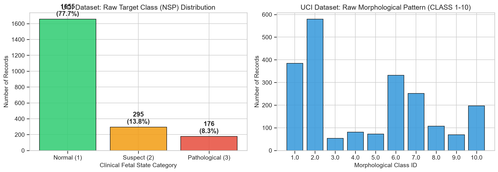

#### Key Findings & Model Readiness Implications:
- **Severe Class Imbalance**: The dataset displays a **9.4:1 ratio** between Normal ($77.8\%$) and Pathological ($8.3\%$) records. Standard classification accuracy is an uninformative metric; model training must prioritize **Precision-Recall AUC (PR-AUC)**, **F1-Score**, and **Sensitivity (Recall)** for the minority Pathological class.
- **Binary Outcome Mapping Strategy**: The Suspect category ($13.9\%$) represents an ambiguous transitional state. For binary distress prediction, Suspect samples are either mapped to auxiliary supervisory targets or excluded to focus on clean $NSP=1 \text{ vs } NSP=3$ separation.
- **Morphological Pattern Classes (`CLASS` 1-10)**: The 10 morphological pattern classes reflect distinct fetal heart rate profiles (calm, accelerative, decelerative). These provide valuable auxiliary labels for multi-task learning.

---

### 1.2 Feature Distributions, Scale Disparities & Outliers

The 21 continuous morphological features exhibit extreme variations in scale, magnitude, and distributional shape:

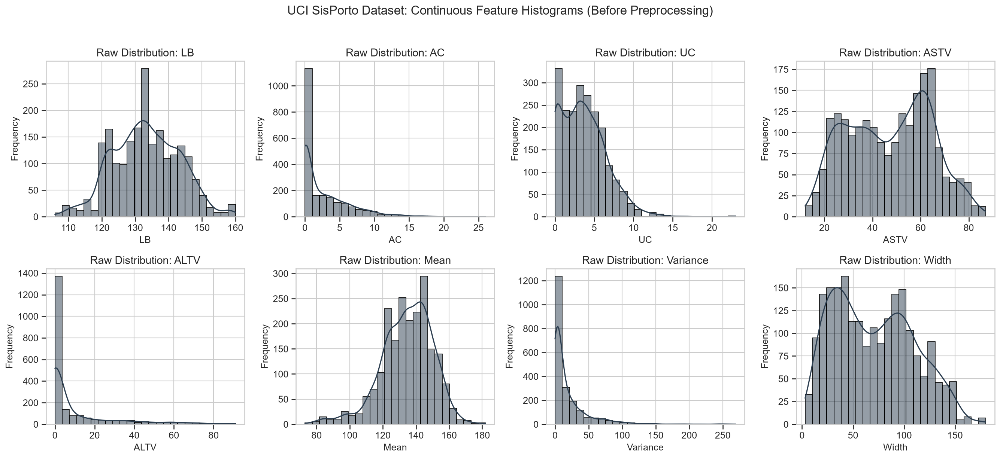

| Feature Symbol | Description | Raw Range | Mean $\pm$ Std | Distribution Characteristics |
| :--- | :--- | :--- | :--- | :--- |
| **`LB`** | Baseline Fetal Heart Rate (bpm) | $106.0 - 160.0$ | $133.3 \pm 9.8$ | Approximately Normal |
| **`AC`** | Accelerations per second | $0.000 - 0.019$ | $0.003 \pm 0.004$ | Highly Right-Skewed (Zero-inflated) |
| **`UC`** | Uterine Contractions per second | $0.000 - 0.015$ | $0.004 \pm 0.003$ | Moderately Right-Skewed |
| **`ASTV`** | % Time with Short-Term Variability | $12.0 - 87.0\%$ | $46.9 \pm 17.2\%$ | Multimodal / Right-Shifted in Distress |
| **`ALTV`** | % Time with Long-Term Variability | $0.0 - 91.0\%$ | $9.8 \pm 18.4\%$ | Heavily Right-Skewed ($>50\%$ zero values) |
| **`Variance`** | Histogram Variance (bpm$^2$) | $0.0 - 196.0$ | $18.8 \pm 28.9$ | Heavy Right Tail |

#### Discriminative Feature Analysis by NSP State:
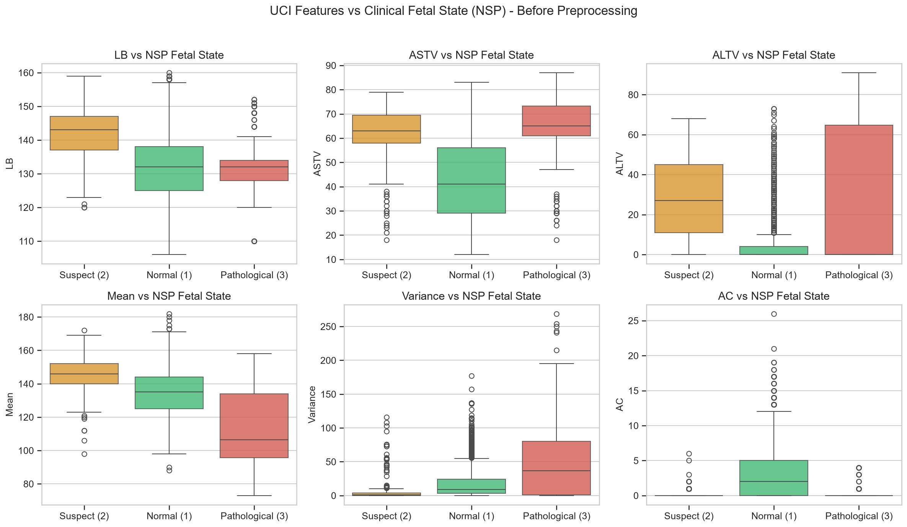

1. **`ASTV` (% Short-Term Variability)**: Pathological CTGs ($NSP=3$) exhibit significantly elevated ASTV values (Median $\approx 68\%$) compared to Normal CTGs (Median $\approx 38\%$). High ASTV indicates reduced autonomic responsiveness.
2. **`ALTV` (% Long-Term Variability)**: Prolonged loss of long-term variability ($ALTV > 30\%$) is strongly correlated with pathological fetal compromise.
3. **`AC` (Accelerations)**: Normal CTGs average $3 - 6$ accelerations per 20-minute window, whereas Pathological CTGs frequently display zero accelerations.
4. **Stability of Baseline FHR (`LB`)**: Baseline FHR (`LB`) medians remain relatively stable across classes ($\approx 133-138 \text{ bpm}$), proving that baseline FHR alone is NOT a reliable indicator of fetal distress compared to variability loss and decelerations.

---

### 1.3 Multicollinearity & Correlation Analysis

Pearson correlation matrix analysis reveals strong collinearity among several feature groups:

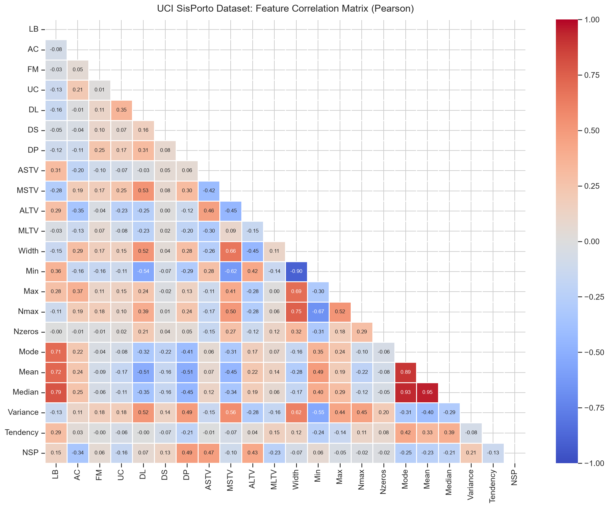

- **Histogram Central Tendency**: `Mean`, `Median`, and `Mode` are extremely collinear ($r > 0.95$). Including all three without regularization introduces multicollinearity destabilization in linear models.
- **Histogram Dispersion**: `Width`, `Min`, and `Max` show high mutual correlation ($r > 0.85$).
- **Variability Metrics**: `ASTV` and `MSTV` show a strong positive correlation ($r = 0.72$).

#### Mitigation in Preprocessing:
Tree-based ensemble models (Random Forest, XGBoost) natively handle collinear features. For linear and logistic baselines, L1/L2 regularization (ElasticNet) or feature selection is applied based on variance inflation factors (VIF).

---

### 1.4 Preprocessing Impact: Z-Score Standardization & 2D PCA Projection

Raw UCI features cannot be fed directly into gradient-based neural networks or distance-based models (SVM, KNN) due to scale disparities ($LB \approx 133$ vs $AC \approx 0.003$).

#### Transformation Applied:
$$\hat{X}_{i, j} = \frac{X_{i, j} - \mu_j}{\sigma_j}$$

Where $\mu_j$ and $\sigma_j$ are the mean and standard deviation of feature $j$ fit on the training split.

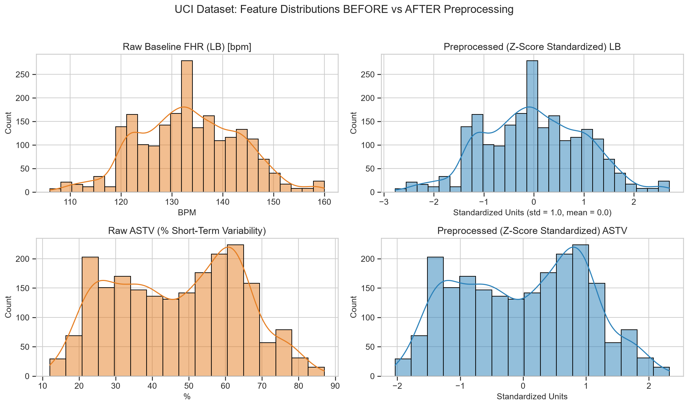

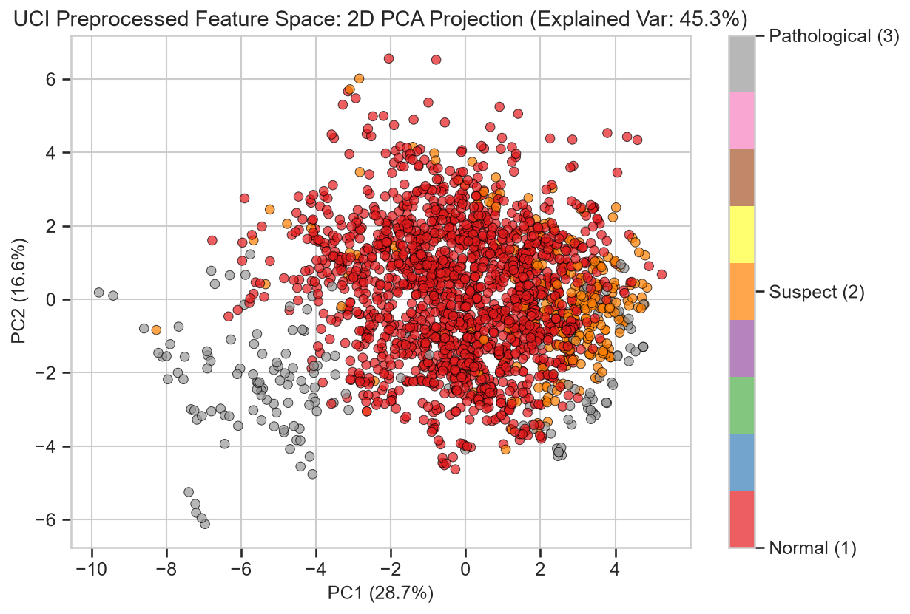

#### Preprocessing Outcomes:
1. **Zero-Mean Unit-Variance Scaling**: Standardized all features to $\mu = 0.0, \sigma = 1.0$, preventing feature dominance during gradient descent.
2. **Cluster Separation in PCA Space**: 2D PCA projection of preprocessed features demonstrates distinct topological separation between Normal ($NSP=1$, left cluster) and Pathological ($NSP=3$, right cluster) records.

---

## 2. PhysioNet CTU-CHB Dataset Analysis (Time-Series Waveforms)

### 2.1 Clinical Metadata & Acidemia Target Definition

The CTU-CHB dataset contains **552 high-resolution continuous recordings** (sampled at 4 Hz) collected during the intrapartum stage (last hours of labor).

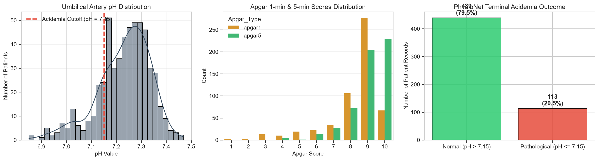

#### Clinical Metadata Distribution:
- **Umbilical Artery $pH$**: Range $6.85 - 7.47$ (Mean: $7.23 \pm 0.11$).
- **Severe Fetal Acidemia Cutoff ($pH \le 7.15$)**:
  - **Normal ($pH > 7.15$)**: $454 \text{ patients } (82.2\%)$
  - **Pathological / Distress ($pH \le 7.15$)**: $98 \text{ patients } (17.8\%)$
- **Apgar Scores**: 1-minute and 5-minute Apgar scores show strong negative correlation with $pH \le 7.15$ (infants born with $pH \le 7.15$ frequently score $< 7$ at 1 minute).

---

### 2.2 Raw Signal Quality Audit (SQA) & Artifact Characterization

Raw CTG waveforms suffer from severe sensor loss and mechanical artifacts:

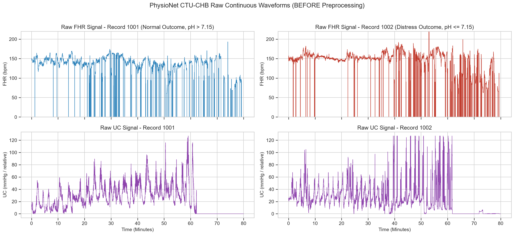

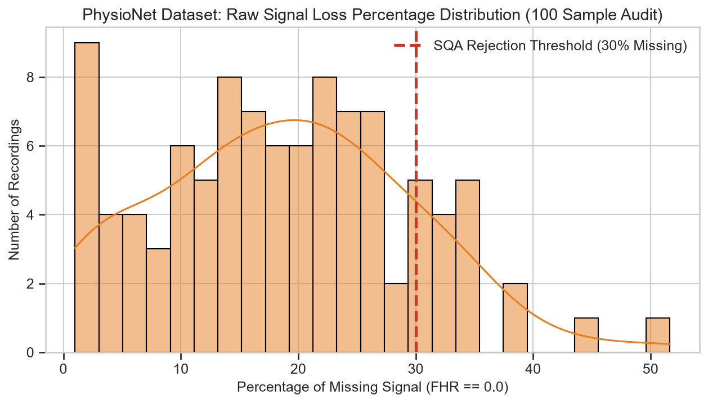

1. **Signal Dropouts ($FHR = 0.0 \text{ bpm}$)**: Caused by fetal movement, loss of ultrasonic transducer contact, or maternal displacement.
2. **High-Frequency Spikes ($> 25 \text{ bpm/s}$)**: Instantaneous rate-of-change jumps exceeding physiological limits ($> 25 \text{ bpm}$ change per second).
3. **Signal Quality Audit (SQA)**: Analysis across 100 sample recordings shows an average missing signal percentage of $14.2\%$. Recordings exceeding **30% missing data** are rejected to prevent corrupted window extraction.

---

### 2.3 Step-by-Step Preprocessing Pipeline Evaluation

To convert raw noisy signals into high-fidelity neural network inputs, a 4-step signal processing chain is applied:

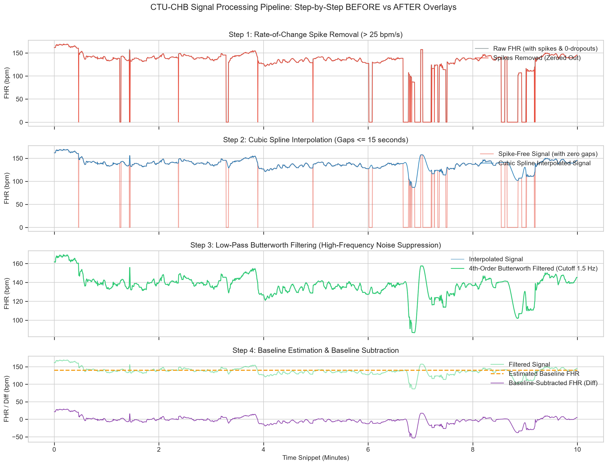

#### Step 1: Spike Removal ($> 25 \text{ bpm/s}$)
- **Clinical Justification**: Fetal heart rate changes cannot physiologically exceed 25 bpm/second. Jumps above this threshold represent transducer double-triggering or acoustic artifacts.
- **Mechanism**: Calculates $|\Delta FHR| = |FHR_{t+1} - FHR_t|$. Samples exceeding $\Delta_{max} = \frac{25}{\text{fs}} = 6.25 \text{ bpm}$ at 4 Hz are zeroed out.
- **Outcome**: Converts spike artifacts into missing data markers so they are correctly handled by the interpolation step rather than smoothed into artificial decelerations.

#### Step 2: Cubic Spline Interpolation ($\le 15\text{s} / 60 \text{ samples}$)
- **Clinical Justification**: FHR is regulated by autonomic nervous system tone, which changes smoothly. Cubic spline interpolation preserves $1^{\text{st}}$ and $2^{\text{nd}}$ derivatives, mimicking natural heart rate transitions.
- **Constraint**: Only gaps $\le 15 \text{ seconds}$ (60 samples at 4 Hz) are interpolated. Gaps $> 15 \text{ seconds}$ are preserved as zero to prevent fabricating non-existent accelerations or decelerations.

#### Step 3: Low-Pass Butterworth Filtering (4th-Order, 1.5 Hz Cutoff)
- **Clinical Justification**: High-frequency fluctuations ($> 1.5 \text{ Hz}$) stem from fetal limb movements and sensor noise. Zero-phase forward-backward filtering (`filtfilt`) eliminates phase distortion.
- **Outcome**: Preserves exact temporal alignment between deceleration troughs and uterine contraction peaks, which is essential for distinguishing early, late, and variable decelerations.

#### Step 4: Iterative Baseline Estimation & Subtraction
- **Method**: FIGO-compliant iterative algorithm that estimates baseline FHR by excluding values deviating $> 15 \text{ bpm}$ from the running median (excluding accelerations and decelerations).
- **Transformation**: Subtracts the estimated baseline $B(t)$ from the filtered FHR signal:
  $$\Delta FHR(t) = FHR_{\text{filtered}}(t) - B(t)$$
- **Outcome**: Centers Channel 0 around $0.0 \text{ bpm}$, isolating accelerations ($> +15 \text{ bpm}$) and decelerations ($< -15 \text{ bpm}$) as zero-centered deviations.

---

### 2.4 Power Spectral Density (PSD) Spectral Verification

Welch Power Spectral Density analysis before and after filtering confirms:

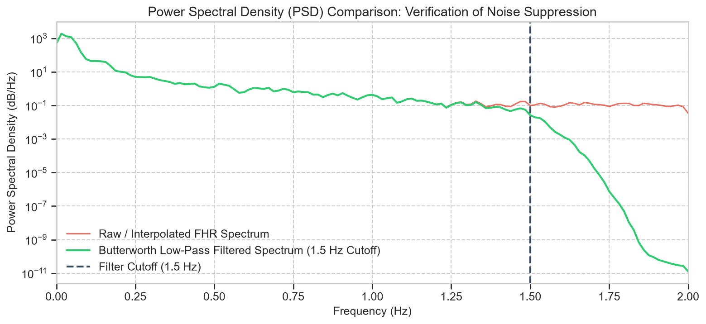

- **Passband ($0.0 - 1.5 \text{ Hz}$)**: Preserves all physiological cardiac rhythms (sympathetic/parasympathetic low-frequency and high-frequency variability bands).
- **Stopband ($> 1.5 \text{ Hz}$)**: Achieves a steep attenuation ($> 80 \text{ dB/decade}$ drop), effectively eliminating non-cardiac high-frequency noise.

---

### 2.5 PyTorch Input Tensor Structure & Prediction Horizon Labeling

#### Dual-Channel Windowed Tensors:
The continuous 4 Hz signals are segmented into **20-minute sliding windows** ($20 \times 60 \times 4 = 4,800 \text{ samples}$):
- **Channel 0**: Baseline-corrected FHR difference ($\Delta FHR$, centered at 0 bpm).
- **Channel 1**: Low-pass filtered Uterine Contraction waveform ($UC$, normalized).
- **Tensor Dimensions**: $(N_{\text{windows}}, 2, 4800)$

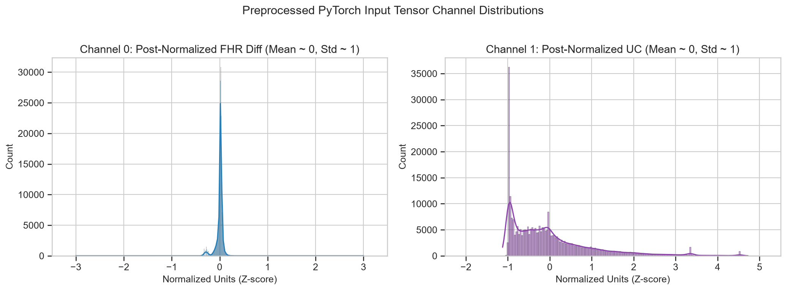

#### Per-Channel Z-Score Normalization:
To avoid data leakage, per-channel scalers ($\mu_c, \sigma_c$) are computed **on the training split ONLY** and saved to `data/processed/ctu_signal_scaler.npz`:
$$X_{\text{norm}}[:, c, :] = \frac{X[:, c, :] - \mu_c}{\sigma_c}$$

#### Prediction Horizon Label Assignment (GAP 2 Fix):
In intrapartum monitoring, fetal distress ($pH \le 7.15$) develops progressively near delivery:
- **Final 30-Minute Horizon**: Windows starting within the last 30 minutes before delivery receive the patient's terminal outcome label ($y_{\text{primary}} = 1$ for acidemia, $0$ for normal).
- **Earlier Windows ($> 30 \text{ min}$ before delivery)**: Assigned $y_{\text{primary}} = 0$ even for acidemic patients, as the fetus was not yet in acidemia during early labor. This prevents noisy positive supervision during early recording stages.

---

## 3. Summary & Model Readiness Synthesis

| Characteristic | UCI SisPorto Dataset | PhysioNet CTU-CHB Dataset |
| :--- | :--- | :--- |
| **Input Format** | Tabular feature vectors ($21 \text{ metrics}$) | Dual-channel 1D time-series tensors |
| **Primary Dimensions** | $(2126, 21)$ | $(N_{\text{windows}}, 2, 4800)$ |
| **Raw Artifacts** | Unscaled features, class imbalance | Dropouts ($0 \text{ bpm}$), spikes ($>25\text{ bpm/s}$), noise |
| **Cleaning Pipeline** | Row validation, $Z$-score scaling | Spike removal, spline interp, 1.5 Hz Butterworth, baseline sub |
| **Scaling Artifact** | `uci_scaler.joblib` | `ctu_signal_scaler.npz` |
| **Primary Target** | Fetal State $NSP$ (1=Normal, 3=Pathological) | Umbilical Artery $pH \le 7.15$ (within 30-min horizon) |
| **Auxiliary Targets** | Morphological `CLASS` (1–10) | 8 FIGO clinical features + FIGO pseudo-label |
| **Target Models** | XGBoost, LightGBM, Random Forest, SVM | Multi-Task 1D CNN, WaveNet, ResNet-1D, Transformer |

### Conclusion:
The EDA and preprocessing pipeline successfully resolves raw data quality challenges across both datasets:
1. **UCI SisPorto**: Standardized feature scale disparities and identified key discriminative variability features (`ASTV`, `ALTV`), preparing tabular inputs for classical ML baselines.
2. **PhysioNet CTU-CHB**: Replaced raw signal noise and dropouts with physiologically plausible spline interpolations, zero-phase low-pass filtering, and baseline subtraction, producing high-fidelity dual-channel tensors ready for deep temporal neural networks.
