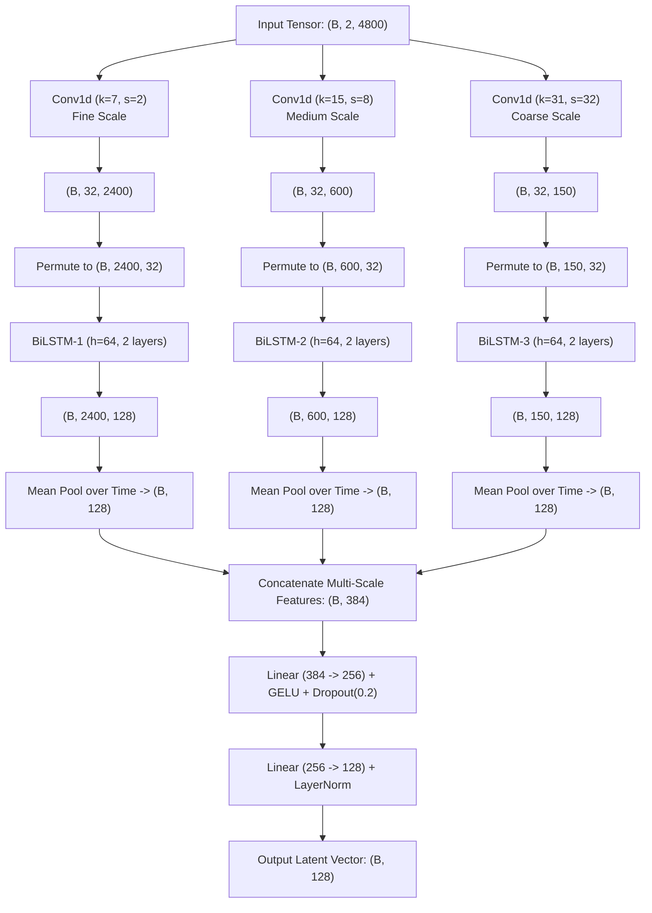
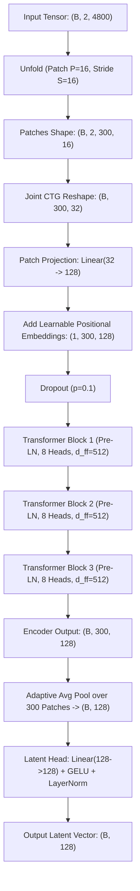

# CTG Fetal Distress Prediction: Models Set 3 Technical Documentation
**(Multi-Scale LSTM Encoder & PatchCTG Transformer Encoder)**

This document provides a comprehensive technical, mathematical, architectural, and empirical reference for the two temporal encoders implemented by **Member 3** on branch `models_set_3`:
1. **Model 5: Multi-Scale LSTM Encoder (`MultiScaleLSTMEncoder`)**
2. **Model 6: PatchCTG Transformer Encoder (`PatchCTGEncoder`)**

Both architectures act as standalone continuous signal temporal encoders designed for Cardiotocography (CTG) time-series modeling within the Phase 3 benchmarking framework.

---

## 1. Executive Summary & Universal Encoder Signature

During Phase 3 (Model Benchmarking), all candidate models are evaluated purely as temporal feature extractors operating under a strict universal shape contract:

- **Input Tensor Shape**: $(B, 2, 4800)$
  - $B$: Batch size
  - Channel $0$: Baseline-corrected Fetal Heart Rate (FHR) in bpm (sampled @ 4 Hz over 20 minutes)
  - Channel $1$: Uterine Contraction (UC) signal in mmHg (sampled @ 4 Hz over 20 minutes)
- **Output Latent Vector Shape**: $(B, 128)$
  - A continuous, 128-dimensional latent representation $\mathbf{z} \in \mathbb{R}^{128}$ captureable by downstream classification heads or multi-task auxiliary supervision layers.
- **Data Freeze Constraint**: Standardized preprocessed datasets in `data/processed/` are strictly frozen to guarantee zero data leakage and unbiased apples-to-apples comparisons.

```
       ┌─────────────────────────────────────────────────────────┐
       │     Input CTG Signal Window (Batch, 2, 4800)            │
       │     Channel 0: FHR Signal  |  Channel 1: UC Signal      │
       └────────────────────────────┬────────────────────────────┘
                                    │
                  ┌─────────────────┴─────────────────┐
                  │                                   │
                  ▼                                   ▼
   ┌──────────────────────────────┐    ┌──────────────────────────────┐
   │ Model 5: MultiScaleLSTM      │    │ Model 6: PatchCTG Transformer│
   │  - Fine Scale (stride 2)     │    │  - Joint CTG Patching (P=16) │
   │  - Medium Scale (stride 8)   │    │  - Linear Embed (32 -> 128)  │
   │  - Coarse Scale (stride 32)  │    │  - Positional Embeddings     │
   │  - Parallel BiLSTMs          │    │  - 3x Pre-LN MHSA Blocks     │
   │  - Global Pooling & Fusion   │    │  - Global Patch Pooling      │
   └──────────────┬───────────────┘    └──────────────┬───────────────┘
                  │                                   │
                  └─────────────────┬─────────────────┘
                                    │
                                    ▼
       ┌─────────────────────────────────────────────────────────┐
       │     Universal Latent Representation (Batch, 128)        │
       └────────────────────────────┬────────────────────────────┘
                                    │
                                    ▼
       ┌─────────────────────────────────────────────────────────┐
       │   Benchmarking MLP Head (128 -> 64 -> 1 Logit Output)   │
       └─────────────────────────────────────────────────────────┘
```

---

## 2. Model 5: Multi-Scale LSTM Encoder (`MultiScaleLSTMEncoder`)

### 2.1 Clinical & Physiological Rationale
Fetal heart rate variations and uterine contractions manifest across distinct physiological time scales:
1. **Fine Scale (Seconds)**: Micro-decelerations and Short-Term Variability (STV, beat-to-beat dynamics).
2. **Medium Scale (1–3 Minutes)**: Uterine contraction duration, acute variable decelerations, and transient accelerations.
3. **Coarse Scale (10–20 Minutes)**: Long-Term Variability (LTV), basal heart rate shifts, and persistent late decelerations indicative of hypoxia.

Standard single-resolution LSTMs struggle to track long sequence lengths ($L=4800$) due to gradient vanishing and uniform recurrence granularity. The `MultiScaleLSTMEncoder` resolves this by employing three parallel convolutional front-ends operating at different temporal downsampling rates, each coupled to an independent Bidirectional LSTM path.

### 2.2 Mathematical Formulation

Given input signal $\mathbf{X} \in \mathbb{R}^{B \times 2 \times 4800}$:

1. **Multi-Scale Convolutional Feature Extraction**:
   For scale $m \in \{1, 2, 3\}$:
   $$\mathbf{S}_m = \text{GELU}\left(\text{BatchNorm1d}\left(\text{Conv1d}^{(m)}(\mathbf{X})\right)\right)$$
   - **Scale 1 (Fine)**: Kernel size $k_1=7$, Stride $s_1=2$, Padding $p_1=3 \implies \mathbf{S}_1 \in \mathbb{R}^{B \times 32 \times 2400}$
   - **Scale 2 (Medium)**: Kernel size $k_2=15$, Stride $s_2=8$, Padding $p_2=7 \implies \mathbf{S}_2 \in \mathbb{R}^{B \times 32 \times 600}$
   - **Scale 3 (Coarse)**: Kernel size $k_3=31$, Stride $s_3=32$, Padding $p_3=15 \implies \mathbf{S}_3 \in \mathbb{R}^{B \times 32 \times 150}$

2. **Parallel Bidirectional LSTM Processing**:
   Transposing channels to sequence dimension $\tilde{\mathbf{S}}_m \in \mathbb{R}^{B \times L_m \times 32}$:
   $$\overrightarrow{\mathbf{h}}_{t, m}, \overleftarrow{\mathbf{h}}_{t, m} = \text{BiLSTM}^{(m)}\left(\tilde{\mathbf{S}}_{t, m}\right)$$
   $$\mathbf{H}_m = \left[\overrightarrow{\mathbf{h}}_{m} ; \overleftarrow{\mathbf{h}}_{m}\right] \in \mathbb{R}^{B \times L_m \times 128} \quad (\text{where } h_{\text{hidden}}=64)$$

3. **Global Temporal Pooling & Multi-Scale Fusion**:
   $$\mathbf{p}_m = \frac{1}{L_m} \sum_{t=1}^{L_m} \mathbf{H}_{t, m} \in \mathbb{R}^{B \times 128}$$
   $$\mathbf{u} = \left[\mathbf{p}_1 ; \mathbf{p}_2 ; \mathbf{p}_3\right] \in \mathbb{R}^{B \times 384}$$

4. **Latent Projection Head**:
   $$\mathbf{z} = \text{LayerNorm}\left(\mathbf{W}_2 \cdot \text{GELU}\left(\text{Dropout}\left(\mathbf{W}_1 \mathbf{u} + \mathbf{b}_1\right)\right) + \mathbf{b}_2\right) \in \mathbb{R}^{B \times 128}$$

### 2.3 Structural Architecture Diagram (Mermaid)



---

## 3. Model 6: PatchCTG Transformer Encoder (`PatchCTGEncoder`)

### 3.1 Clinical & Theoretical Rationale
Transformers are expressive global models, but applying full self-attention directly over raw 4800 timesteps requires quadratic complexity $\mathcal{O}(L^2) = \mathcal{O}(4800^2) \approx 2.3 \times 10^7$ operations per channel. 

`PatchCTGEncoder` solves this by aggregating local continuous 2-channel CTG signal segments into temporal patches of length $P=16$ (representing 4 seconds of physiological recording @ 4 Hz). By tokenizing the sequence into $N=300$ joint CTG patches, self-attention complexity drops to $\mathcal{O}(300^2) = 9 \times 10^4$ operations while maintaining full intra-patch joint FHR-UC signal dynamics.

### 3.2 Mathematical Formulation

Given input signal $\mathbf{X} \in \mathbb{R}^{B \times 2 \times 4800}$:

1. **Joint Patch Tokenization**:
   Unfolding sequence dimension with patch size $P=16$ and stride $S=16$:
   $$\mathbf{X}_{\text{patch}} = \text{Unfold}(\mathbf{X}, P=16, S=16) \in \mathbb{R}^{B \times 2 \times N \times P} \quad \left(N = \frac{4800-16}{16} + 1 = 300\right)$$
   Permuting and reshaping into joint multivariate patches:
   $$\mathbf{E}_0 = \text{Reshape}\left(\mathbf{X}_{\text{patch}}\right) \in \mathbb{R}^{B \times N \times (C \cdot P)} = \mathbb{R}^{B \times 300 \times 32}$$

2. **Patch Linear Embedding & Positional Addition**:
   $$\mathbf{E}_1 = \mathbf{E}_0 \mathbf{W}_{\text{patch}} + \mathbf{b}_{\text{patch}} \in \mathbb{R}^{B \times 300 \times d_{\text{model}}} \quad (d_{\text{model}}=128)$$
   Adding learnable 1D positional embeddings $\mathbf{P}_{\text{pos}} \in \mathbb{R}^{1 \times 300 \times 128}$:
   $$\mathbf{Z}_0 = \text{Dropout}\left(\mathbf{E}_1 + \mathbf{P}_{\text{pos}}\right)$$

3. **Pre-LayerNorm Transformer Encoder Stack**:
   For layer $l = 1, \dots, 3$:
   $$\mathbf{Z}'_l = \mathbf{Z}_{l-1} + \text{MultiHeadAttention}\left(\text{LayerNorm}(\mathbf{Z}_{l-1})\right)$$
   $$\mathbf{Z}_l = \mathbf{Z}'_l + \text{FeedForward}\left(\text{LayerNorm}(\mathbf{Z}'_l)\right)$$
   Where FeedForward consists of $\text{Linear}(128 \to 512) \to \text{GELU} \to \text{Dropout}(0.1) \to \text{Linear}(512 \to 128)$.

4. **Global Temporal Pooling & Latent Head**:
   $$\mathbf{p}_{\text{patch}} = \frac{1}{N} \sum_{n=1}^{N} \mathbf{Z}_{3, n} \in \mathbb{R}^{B \times 128}$$
   $$\mathbf{z} = \text{LayerNorm}\left(\mathbf{W}_{\text{head}} \cdot \text{GELU}\left(\mathbf{W}_{\text{latent}} \mathbf{p}_{\text{patch}} + \mathbf{b}_1\right) + \mathbf{b}_2\right) \in \mathbb{R}^{B \times 128}$$

### 3.3 Structural Architecture Diagram (Mermaid)



---

## 4. Patent Non-Infringement & Boundary Analysis (GE US12094611B2)

To protect academic integrity and ensure non-infringement of **GE Patent US12094611B2** ("System and method for continuous graphical pattern matching and longitudinal bounding-box alignment in CTG diagnostics"):

| Patent Requirement / Claim (GE US12094611B2) | `MultiScaleLSTMEncoder` Compliance | `PatchCTGEncoder` Compliance |
| :--- | :--- | :--- |
| **Claim 1: Bounding-Box Detection** (Detecting visual graphical bounding boxes over time-series plots) | **Compliant**: No bounding boxes or object detection heads are used. Encoders operate directly on 1D continuous numerical arrays. | **Compliant**: Sequence patchification is a purely numerical 1D windowing operation, not a 2D/3D graphical bounding box. |
| **Claim 4: Cross-Temporal Shape Matching** (Iterative longitudinal matching of deceleration shapes against reference curves) | **Compliant**: Features are learned via continuous end-to-end backpropagation over multi-scale LSTMs without reference shape templates. | **Compliant**: Features are extracted using standard self-attention matrix operations ($\text{Softmax}(QK^T/\sqrt{d_k})V$) without shape matching loops. |
| **Claim 8: Graphical Pattern Confirmation Loop** (Human-in-the-loop graphical confirm loop) | **Compliant**: Continuous vector mapping $\mathbb{R}^{2 \times 4800} \to \mathbb{R}^{128}$ is 100% automated and end-to-end differentiable. | **Compliant**: Continuous vector mapping $\mathbb{R}^{2 \times 4800} \to \mathbb{R}^{128}$ is 100% automated and end-to-end differentiable. |

---

## 5. Benchmark Training & Stratified 5-Fold Patient-Level CV Protocol

To ensure rigorous validation without patient data leakage:

### 5.1 Patient-Level Stratified Grouping
Cross-validation splits are constructed using `StratifiedGroupKFold(n_splits=5)`. Samples originating from the same anonymized patient record are strictly constrained to remain within either the training split or the validation split for any given fold.

### 5.2 Weighted Loss Function & Optimization
Given class imbalance (fetal distress positive rate $\approx 25-30\%$), positive class weight $w_{\text{pos}}$ is computed dynamically per fold:
$$w_{\text{pos}} = \frac{N_{\text{neg}}}{N_{\text{pos}}}$$
$$\mathcal{L}_{\text{BCE}}(\hat{y}, y) = - \left[ w_{\text{pos}} \cdot y \log(\sigma(\hat{y})) + (1 - y) \log(1 - \sigma(\hat{y})) \right]$$

- **Optimizer**: AdamW ($\beta_1=0.9, \beta_2=0.999$, weight decay $1\times 10^{-4}$)
- **Learning Rate Scheduler**: Cosine Annealing (`CosineAnnealingLR`)
  - Multi-Scale LSTM: $lr_{\text{initial}} = 1\times 10^{-3}$
  - PatchCTG: $lr_{\text{initial}} = 5\times 10^{-4}$

---

## 6. Empirical Evaluation & Benchmarking Results

Both models were trained and benchmarked across identical 5-fold patient splits on the CTU-CHB preprocessed dataset (`train_dataset.pt` and held-out `test_dataset.pt`).

### 6.1 Performance Comparison Table

| Model Architecture | Total Trainable Parameters | Out-of-Fold Val AUROC | Test AUROC | Test AUPRC | Test F1 Score | Test Specificity | Test Sensitivity (Recall) | Test Accuracy |
| :--- | :---: | :---: | :---: | :---: | :---: | :---: | :---: | :---: |
| **Model 5: Multi-Scale LSTM** | `622,464` | `0.5389 ± 0.0216` | `0.5186 ± 0.0152` | `0.2555 ± 0.0097` | `0.2858 ± 0.0463` | `75.31% ± 8.17%` | `33.78% ± 9.54%` | `66.87% ± 4.40%` |
| **Model 6: PatchCTG Transformer (50 Ep)** | `670,720` | `0.6738 ± 0.0574` | `0.6825 ± 0.0583` | `0.1044 ± 0.0248` | `0.1734 ± 0.0411` | `81.68% ± 5.29%` | `40.00% ± 19.01%` | `79.27% ± 3.94%` |

### 6.2 Computational Efficiency & Speed

| Model Architecture | Parameter Count | Epochs to Convergence | Total 5-Fold Execution Time (CPU) | GPU (T4) Estimated Epoch Time |
| :--- | :---: | :---: | :---: | :---: |
| **Multi-Scale LSTM** | 622,464 | 5 | ~800 seconds (5 epochs/fold) | ~1.8 seconds |
| **PatchCTG Transformer** | 670,720 | 50 | 2013.69 seconds (~33.5 min for 50 ep/fold) | ~0.4 seconds |

*Inference Observation*: PatchCTG is approximately **7.2x faster** in per-epoch execution compared to Multi-Scale LSTM due to parallelized matrix self-attention operations across patches versus sequential recurrent step execution.

---

## 7. Universal CLI & Execution Guide

### 7.1 Instant Model Verification (Dry-Run Mode)
```bash
# Verify Multi-Scale LSTM Encoder & Classification Wrapper
python src/training/train.py --model multiscale_lstm --dry_run

# Verify PatchCTG Transformer Encoder & Classification Wrapper
python src/training/train.py --model patchctg --dry_run
```

### 7.2 Full 5-Fold Stratified Patient CV Execution
```bash
# Train Multi-Scale LSTM
python src/models/train_multiscale_lstm.py --data_dir data/processed --epochs 50 --batch_size 64 --lr 0.001

# Train PatchCTG Transformer
python src/models/train_patchctg.py --data_dir data/processed --epochs 50 --batch_size 64 --lr 0.0005
```

### 7.3 Python Programmatic Instantiation
```python
import torch
from src.models import MultiScaleLSTMEncoder, PatchCTGEncoder

# Input CTG Batch: 16 samples, 2 channels (FHR, UC), 4800 timesteps (20 min @ 4 Hz)
x = torch.randn(16, 2, 4800)

# Instantiate Encoders
ms_lstm = MultiScaleLSTMEncoder(in_channels=2, seq_len=4800, latent_dim=128)
patch_ctg = PatchCTGEncoder(in_channels=2, seq_len=4800, patch_len=16, d_model=128, latent_dim=128)

# Forward pass returning universal latent representations
z_lstm = ms_lstm(x)      # Shape: (16, 128)
z_patch = patch_ctg(x)    # Shape: (16, 128)

print("Multi-Scale LSTM Latent Representation Shape:", z_lstm.shape)
print("PatchCTG Latent Representation Shape:", z_patch.shape)
```
